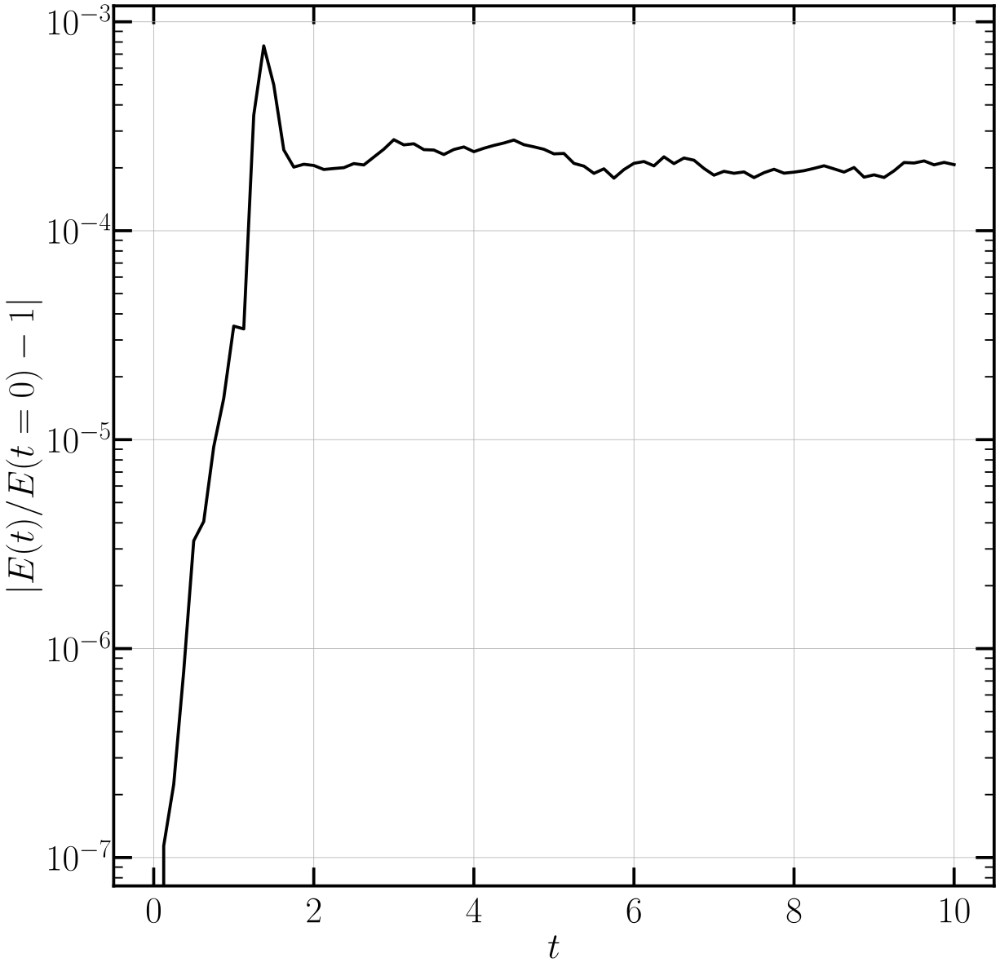
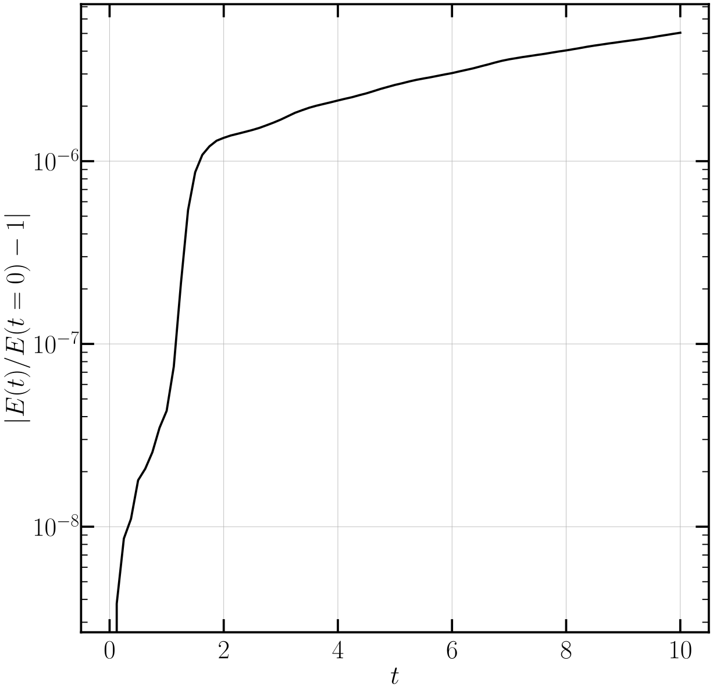
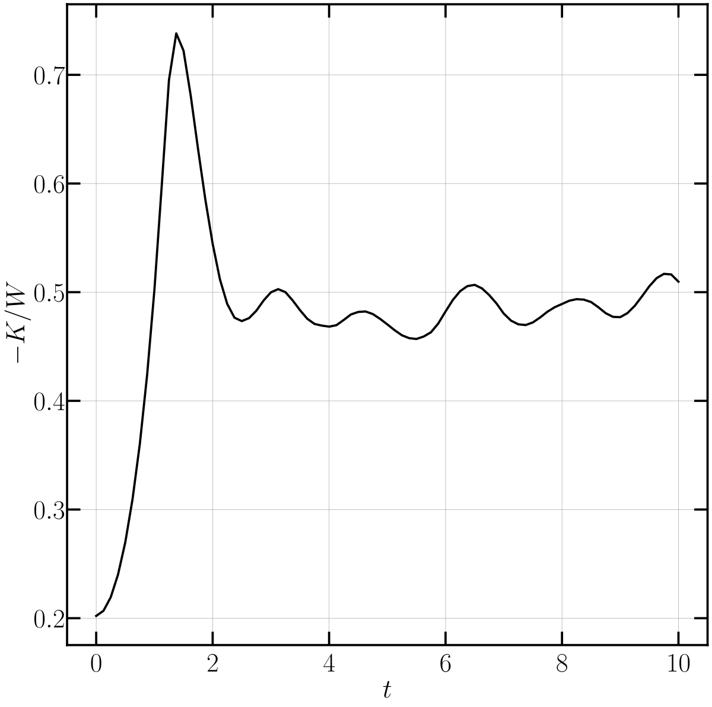
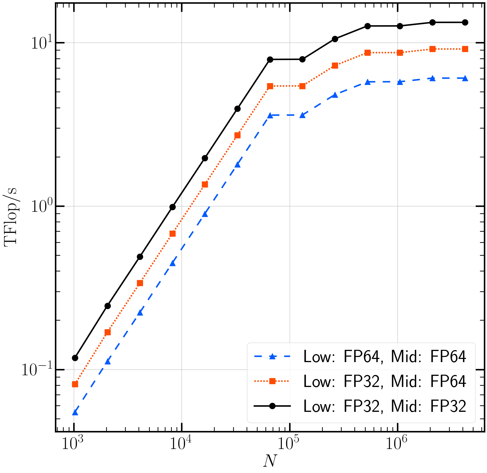
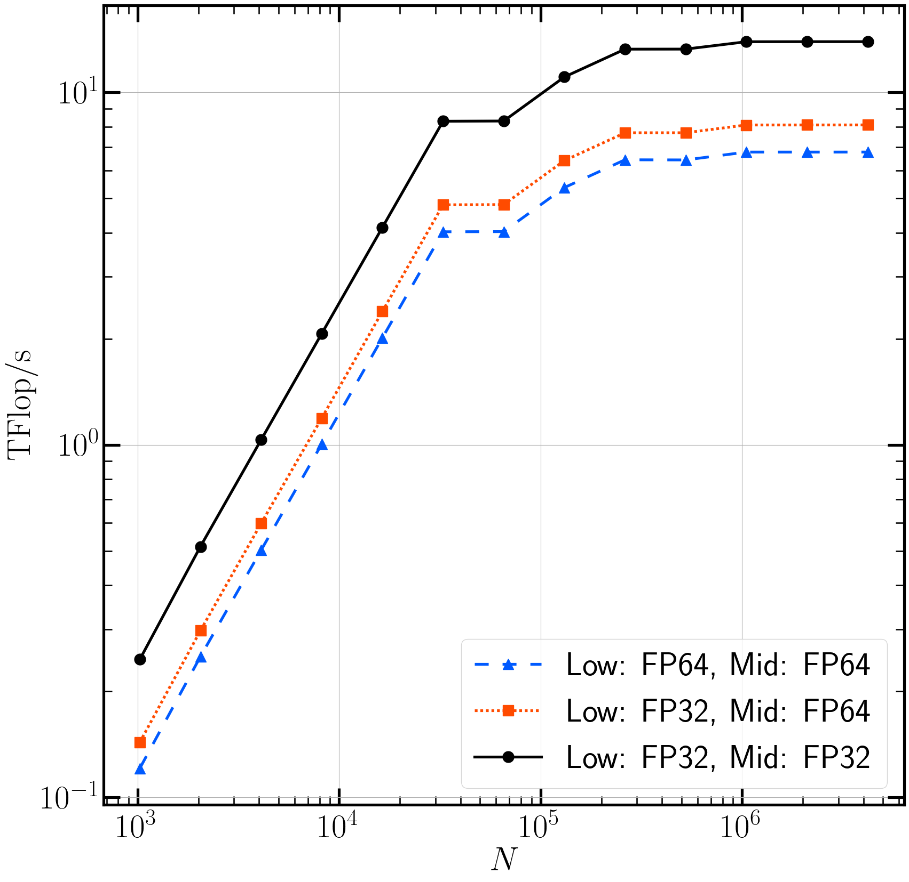

# $N$体計算コード（直接法）のGPU実装例

$N$体計算コード（直接法）を様々なGPU向けプログラミング手法で実装する

## 概要

* 各種開発環境を用いたdirect $N$-body codeの実装比較・性能評価
  * C++実装：CPU向けのナイーブな実装（ベースライン実装）
  * [CUDA C++による実装](/cuda.md)
  * [OpenACCを用いたGPUオフローディング](/openacc.md)
  * [OpenMPのターゲット指示文を用いたGPUオフローディング](/openmp.md)
  * [C++17の標準言語規格を用いたGPUオフローディング](/stdpar.md)
* Released under the MIT license, see LICENSE.txt
* Copyright (c) 2022 Yohei MIKI

## 取得方法

  ```sh
  git clone --recurse-submodules git@github.com:ymiki-repo/nbody.git
  ```

## コンパイル方法

* <details><summary>コンパイルに必要なライブラリ・ツールキット:</summary>

  * CMake (>= 3.20)
    * NVIDIA HPC SDKのサポートが v3.20 以降のため
  * Boost
  * HDF5
  </details>

  * <details><summary>Miyabi-G 上でのモジュール設定方法（NVIDIA HPC SDK使用時）</summary>

    ```sh
    module purge       # for safety
    module load nvidia # NVIDIA HPC SDK
    module load hdf5   # HDF5
    ```

  </details>

  * <details><summary>Miyabi-G 上でのモジュール設定方法（CUDA使用時）</summary>

    ```sh
    module purge      # for safety
    module load cuda  # CUDA
    module load use /work/share/opt/modules/lib   # required to load hdf5
    module load hdf5  # HDF5
    ```

  </details>

  * <details><summary>Wisteria/BDEC-01 (Aquarius) 上でのモジュール設定方法（NVIDIA HPC SDK使用時）</summary>

    ```sh
    module purge       # for safety
    module load cmake  # CMake: just for compilation
    module load nvidia/22.7 # NVIDIA HPC SDK
    module load hdf5   # HDF5
    ```

  </details>

  * <details><summary>Wisteria/BDEC-01 (Aquarius) 上でのモジュール設定方法（CUDA使用時）</summary>

    ```sh
    module purge      # for safety
    module load cmake # CMake: just for compilation
    module load cuda  # CUDA
    module load gcc   # GCC: required to load hdf5
    module load hdf5  # HDF5
    ```

  </details>

* <details><summary>可視化に用いるツールキット（オプション）:</summary>

  * Julia
  * VisIt

  </details>

* <details><summary>GUIツール（ccmake）を併用しての設定方法</summary>

  ```sh
  cmake -S . -B build # source directory is the current directory, target directory is build/
  cd build
  ccmake -S ..
  ```

  </details>

* <details><summary>コマンドラインのみでの設定方法</summary>

  ```sh
  cmake -S . -B build [option] # source directory is the current directory, target directory is build/
  cd build
  ```

  </details>

* <details><summary>キャッシュを無視して再設定する方法（CMake 3.24以降）</summary>

  ```sh
  cmake --fresh -S . -B build [option] # introduced in CMake 3.24
  ```

  </details>

* <details><summary>CMake用のビルドオプション:</summary>

  | 入力 | 概要 |
  | ---- | ---- |
  | `-DBENCHMARK_MODE=[ON OFF(default)]` | On to perform benchmark |
  | `-DCALCULATE_POTENTIAL=[ON(default) OFF]` | On to calculate gravitational potential |
  | `-DFP_L=[32(default) 64 128]` | Number of bits for floating-point numbers (low-precision) |
  | `-DFP_M=[32(default) 64 128]` | Number of bits for floating-point numbers (medium-precision) |
  | `-DFP_H=[64(default) 128]` | Number of bits for floating-point numbers (high-precision) |
  | `-DHERMITE_SCHEME=[ON OFF(default)]` | On to adopt 4th-order Hermite scheme instead of 2nd-order leapfrog scheme |
  | `-DSIMD_BITS=[256 512(default) 1024]` | SIMD width in units of bit |
  | `-DUSE_CUDA=[ON OFF(default)]` | On to use CUDA C++ for NVIDIA GPU |
  | `-DTARGET_CPU=[depends on your C++ compiler; selecting by ccmake is encouraged]` | target CPU architecture |
  | `-DGPU_EXECUTION=[ON(default) OFF]` | On to compile code for GPU |
  | `-DOVERWRITE_DEFAULT=[ON OFF(default)]` | On to overwrite default parameters for performance |
  | `-DNTHREADS=[32 64 128 256(default) 512 1024]` | Number of threads per thread-block |
  | `-DUNROLL=[1 2 4 8 16 32 64 128(default) 256 512 1024]` | Number of unroll counts |
  | `-DRELAX_RSQRT_ACCURACY=[ON OFF(default)]` | On to relax precision for reciprocal square root to accelerate simulations (only for NVIDIA HPC SDK) |
  | `-DEXERCISE_MODE=[ON OFF(default)]` | On to use exercise mode |
  | `-DTARGET_GPU=[NVIDIA_CC90(default) NVIDIA_CC80 NVIDIA_CC70]` | target GPU architecture: NVIDIA CC90 (Hopper), NVIDIA CC80 (Ampere), or NVIDIA CC70 (Volta) |
  | `-DTIGHTLY_COUPLED_CPU_GPU=[ON(default) OFF]` | ON for NVIDIA CPU and GPU fused via NVLink-C2C |

  </details>

* <details><summary>コンパイル方法</summary>

  ```sh
  ninja # if ninja-build is installed (e.g., Wisteria/BDEC-01 and Miyabi-G)
  make  # if ninja-build is missing (e.g., GPUクラスタ@CfCA)
  ```

  </details>

## 実行方法

* <details><summary>Miyabi-G (PBS Pro)</summary>

  ```sh
  qsub sh/miyabi-g/run_nvidia.sh # run an $N$-body simulation in default configuration, base compiler is nvidia
  qub sh/miyabi-g/run_nvidia_mig.sh # run an $N$-body simulation in default configuration, base compiler is nvidia, use MIG (Multi-Instance GPU)
  qsub sh/miyabi-g/run_cuda.sh # run an $N$-body simulation in default configuration, base compiler is cuda
  qsub sh/miyabi-g/run_cuda_mig.sh # run an $N$-body simulation in default configuration, base compiler is cuda, use MIG (Multi-Instance GPU)
  qsub -v EXEC=bin/acc_unified,OPTION="--num=16384 --file=acc" sh/miyabi-g/run_nvidia.sh # run an $N$-body simulation with option (binary is bin/acc_unified, $N = 16384$, FILENAME is acc), base compiler is nvidia
  qsub -v EXEC=bin/cuda_memcpy_base,OPTION="--num=16384 --file=cuda_memcpy" sh/miyabi-g/run_cuda.sh # run an $N$-body simulation with option (binary is bin/cuda_memcpy_base, $N = 16384$, FILENAME is cuda_memcpy), base compiler is cuda
  ```

  </details>

* <details><summary>Wisteria/BDEC-01 (Fujitsu TCS)</summary>

  ```sh
  pjsub sh/wisteria/run_nvidia.sh # run an $N$-body simulation in default configuration, base compiler is nvhpc
  pjsub sh/wisteria/run_cuda.sh # run an $N$-body simulation in default configuration, base compiler is cuda
  pjsub -x EXEC=bin/acc_unified,OPTION="--num=16384 --file=acc" sh/wisteria/run_nvidia.sh # run an $N$-body simulation with option (binary is bin/acc_unified, $N = 16384$, FILENAME is acc), base compiler is nvidia
  pjsub -x EXEC=bin/cuda_memcpy_base,OPTION="--num=16384 --file=cuda_memcpy" sh/wisteria/run_cuda.sh # run an $N$-body simulation with option (binary is bin/cuda_memcpy_base, $N = 16384$, FILENAME is cuda_memcpy), base compiler is cuda
  ```

  </details>

* <details><summary>Slurm</summary>

  ```sh
  sbatch sh/slurm/run.sh [option] # run an $N$-body simulation
  sh/slurm/check_conservation_leapfrog2.sh [option] # run a series of $N$-body simulations (check energy conservation of 2nd-order leapfrog scheme)
  sh/slurm/check_conservation_hermite4.sh [option] # run a series of $N$-body simulations (check energy conservation of 4th-order Hermite scheme)
  sh/slurm/check_performance_scaling.sh [option] # run a series of $N$-body simulations (evaluate time-to-solution as a function of the number of $N$-body particles)
  sh/slurm/perform_benchmark.sh [option] # perform benchmark of direct $N$-body simulation (force calculation only)
  ```

  </details>

* <details><summary>出力されるファイル</summary>

  * 計算が正常終了すると，log/ の中に `FILENAME_run.csv` が出力されます
    * [計算結果出力モードで動作させた際の出力例](/gallery/validation/log/leapfrog4096_run.csv)
    * [性能測定モードで動作させた際の出力例](/gallery/performance/log/leapfrog_run.csv)
  * dat/ の中に `FILENAME_snp*.h5` と `FILENAME_snp*.xdmf` が出力されます
    * `BENCHMARK_MODE` が OFF の場合のみ
    * スナップショットの出力例: gallery/validation/dat/
      * 実際には連番で出力されますが，間引いた上でアップロードしています

  </details>

## 可視化のための事前準備（Python および Julia を使用する場合）

1. Matplotlib環境の構築
   * <details><summary>Miyabi-G 向けの環境構築</summary>

     ```sh
     mkdir -p /work/{YOUR_GROUP}/$USER/opt/$(uname -m) # 以下，{YOUR_GROUP} は全てご自分の所属グループに置き換えてください
     cp -r modules /work/{YOUR_GROUP}/$USER/opt/
     # /work/{YOUR_GROUP}/$USER/opt/anyenv 14行目の gt00 をご自分の所属グループに編集してください（必須）
     cd /work/{YOUR_GROUP}/$USER/opt/$(uname -m) # Miyabi-G（aarch64環境）用の環境，Miyabi-C（x86_64環境）用の環境とを分離して構築できるようにするための工夫
     git clone https://github.com/anyenv/anyenv
     module use /work/{YOUR_GROUP}/$USER/opt/modules
     module load anyenv
     anyenv install --init # y/N を聞かれるので，y とする
     git clone https://github.com/znz/anyenv-update.git $(anyenv root)/plugins/anyenv-update
     anyenv update # このコマンドによって，後で導入する pyenv なども update されるようになる
     anyenv install pyenv
     pyenv install -l | grep miniforge3 # インストールできるバージョンを確認
     pyenv install miniforge3-24.11.2-1 # 最新版だった 24.11.2-1 をインストール
     pyenv rehash
     pyenv global miniforge3-24.11.2-1
     pyenv versions
     cd /work/{YOUR_GROUP}/$USER/opt/modules/miniforge3
     ln -s .generic 24.11.2-1 # これは miniforge3-24.11.2-1 をインストールした場合です
     module load miniforge3
     touch /work/{YOUR_GROUP}/$USER/$(uname -m)/.condarc
     mkdir /work/{YOUR_GROUP}/$USER/$(uname -m)/.conda
     ls -a ~ # ホームディレクトリに .condarc や .conda があるかを確認
     mv ~/.condarc ~/.condarc.bak # もしあれば
     mv ~/.conda ~/.conda.bak # もしあれば
     ln -s /work/{YOUR_GROUP}/$USER/$(uname -m)/.conda* ~/
     conda config --env --remove channels defaults
     conda config --env --add channels conda-forge
     # お好みのエディタで /work/{YOUR_GROUP}/$USER/.config/$(uname -m)/.condarc を開き，下記2行を追記（オプション，容量を節約したい場合）
     # allow_softlinks: true
     # always_softlink: true
     conda update --all
     conda install matplotlib
     ```

     </details>

   * <details><summary>Wisteria/BDEC-01 (Aquarius) 向けの環境構築</summary>

     ```sh
     mkdir -p /work/{YOUR_GROUP}/$USER/opt/$(uname -m) # 以下，{YOUR_GROUP} は全てご自分の所属グループに置き換えてください
     cp -r modules /work/{YOUR_GROUP}/$USER/opt/
     # /work/{YOUR_GROUP}/$USER/opt/anyenv 14行目の gt00 をご自分の所属グループに編集してください（必須）
     cd /work/{YOUR_GROUP}/$USER/opt/$(uname -m) # Aquarius（x86_64環境）用の環境と，Odyssey（aarch64環境）用の環境を分離して構築できるようにするための工夫
     git clone https://github.com/anyenv/anyenv
     module use /work/{YOUR_GROUP}/$USER/opt/modules
     module load anyenv
     anyenv install --init # y/N を聞かれるので，y とする
     git clone https://github.com/znz/anyenv-update.git $(anyenv root)/plugins/anyenv-update
     anyenv update # このコマンドによって，後で導入する pyenv なども update されるようになる
     anyenv install pyenv
     pyenv install -l | grep miniforge3 # インストールできるバージョンを確認（miniconda3でも良い）
     pyenv install miniforge3-22.9.0-2
     pyenv rehash
     pyenv global miniforge3-22.9.0-2
     pyenv versions
     cd /work/{YOUR_GROUP}/$USER/opt/modules
     cd miniforge3 # miniconda3 をインストールした場合にはフォルダ名を miniconda3 に mv した上で cd してください
     ln -s .generic 22.9.0-2 # これは miniforge3-22.9.0-2 をインストールした場合です
     module load miniforge3
     touch /work/{YOUR_GROUP}/$USER/$(uname -m)/.condarc
     mkdir /work/{YOUR_GROUP}/$USER/$(uname -m)/.conda
     ls -a ~ # ホームディレクトリに .condarc や .conda があるかを確認
     mv ~/.condarc ~/.condarc.bak # もしあれば
     mv ~/.conda ~/.conda.bak # もしあれば
     ln -s /work/{YOUR_GROUP}/$USER/$(uname -m)/.conda* ~/
     conda config --env --remove channels defaults
     conda config --env --add channels conda-forge
     # お好みのエディタで /work/{YOUR_GROUP}/$USER/.config/$(uname -m)/.condarc を開き，下記2行を追記（オプション，容量を節約したい場合）
     # allow_softlinks: true
     # always_softlink: true
     conda update --all
     conda install matplotlib
     ```

     </details>

1. Julia環境の構築
   * <details><summary>Miyabi-G上での環境構築</summary>

     ```sh
     # 1. sh/miyabi-g/setup_julia.sh 内の gt00（2ヶ所）はご自身の所属グループに編集してください
     # 2. sh/miyabi-g/setup_julia.sh 内の lecture-mig（2行目）はご自身が投入可能なリソースグループに編集してください
     # 3. sh/miyabi-g/setup_julia.sh 14-17行目の Python 環境の設定をご自分の環境に合わせて編集してください（上記設定の通りにPython環境を構築した場合にはこの手順は不要）
     qsub sh/miyabi-g/setup_julia.sh
     ```

     </details>

   * <details><summary>Wisteria/BDEC-01上での環境構築</summary>

     ```sh
     # 1. sh/wisteria/setup_julia.sh 15-18行目の Python 環境の設定をご自分の環境に合わせて編集してください（上記設定の通りにPython環境を構築した場合にはこの手順は不要）
     pjsub --vset PROJ=gz00 -x PROJ=gz00 sh/wisteria/setup_julia.sh # gz00 をご自分の所属グループに編集してください（必須，2ヶ所あります）
     ```

     </details>

   * <details><summary>お手元の環境などでの構築方法</summary>

     ```sh
     module load anyenv miniforge3 # prepare Python environments
     module load openmpi           # prepare MPI to be used
     module load texlive           # prepare LaTeX environments
     module load julia             # prepare Julia environments
     julia jl/package.jl
     julia --project -e 'using MPIPreferences; MPIPreferences.use_system_binary()' # configure to use system-provided MPI
     ```

     </details>

## 計算結果の確認方法

 * <details><summary>Miyabi-G上での実行方法</summary>

   ```sh
   qsub -v OPTION="--target=FILENAME" sh/miyabi-g/plot_error.sh # エネルギー保存などの時間進化を描画，sh/miyabi-g/plot_error.sh 内の gt00 をご自分の所属グループに編集してください（必須，2ヶ所あります）．FILENAMEは$N$体計算実行時に--file=として指定したものです
   ```

   </details>

 * <details><summary>Wisteria/BDEC-01上での実行方法</summary>

   ```sh
   pjsub --vset PROJ=gz00 -x PROJ=gz00,OPTION="--target=FILENAME" sh/wisteria/plot_error.sh # エネルギー保存などの時間進化を描画，gz00 をご自分の所属グループに編集してください（必須，2ヶ所あります）．FILENAMEは$N$体計算実行時に--file=として指定したものです
   pjsub --vset PROJ=gz00 -x PROJ=gz00,OPTION="--target=FILENAME" sh/wisteria/plot_dot.sh   # 粒子分布の時間進化を描画，gz00 をご自分の所属グループに編集してください（必須，2ヶ所あります）．FILENAMEは$N$体計算実行時に--file=として指定したものです
   ```

   </details>

 * <details><summary>Slurm環境などでの実行方法</summary>

   ```sh
   julia jl/plot/error.jl --png                                          # show time evolution of conservatives and the virial ratio
   sbatch --export=EXEC="julia jl/plot/dot.jl" sh/slurm/plot_parallel.sh # show particles distribution by using dots
   visit &                                                               # open dat/FILENAME_snp*.xdmf files and visualize them
   ```

   </details>

* fig/ の中に生成されている画像ファイルを確認する
  * エネルギー保存（`fig/FILENAME_csv_ene.svg`）
    * <details><summary>Leapfrog法の場合</summary>

      * 
      * First collapseのタイミングで誤差が最大
      * 誤差が蓄積していかない

     </details>

    * <details><summary>Hermite法の場合</summary>

      * 
      * Leapfrog法よりも誤差が小さい
      * 誤差が蓄積していく

     </details>

  * <details><summary>ビリアル比 $-K/W$ の時間進化（`fig/FILENAME_virial.svg`）</summary>

    * 
    * 山と谷の間隔が1程度
    * 時間進化の結果，$-K / W \sim 0.5$付近で振動

   </details>

* <details><summary>VisIt を用いて描画する</summary>

  1. VisIt を起動
  2. ファイルを開く（Open から `dat/FILENAME_snp*.xdmf database` を選択し，OK）
  3. 描画
     * 粒子分布を見たいだけであれば，Plots の Add から Mesh > N-body を選択し，Draw する
     * 速度場が見たければ，Plots の Add から Vector > velocity を選択し，Draw する
     * ポテンシャル場を見たければ，Plots の Add から Pseudocolor > potential を選択し，Draw する
       * Pseudocolor plot attributes の Color table を Default から viridis などの colorblindness friendly なものにしておくことを推奨する
       * Invert にもチェックを入れておくと（この場合は）良い
       * 全ての attributes の設定が完了したら，Apply を押して反映する

 </details>

## 性能測定方法

* CMake でのビルド時に `-DBENCHMARK_MODE=ON` を指定
  * 重力計算部分のみの実行時間を測定（CPU-GPU間のデータ転送は含めない）
  * Unified Memory使用版はビルドしない（CPU-GPU間のデータ転送を測定対象から除外しているため，ビルドする意味がない）
* （必要があれば）`-DOVERWRITE_DEFAULT=ON` を指定し，`NTHREADS` や `NUNROLL` といったパラメータの値を指定

* <details><summary>Miyabi-G (PBS Pro)</summary>

  ```sh
  qsub -v EXEC=bin/cuda_memcpy_shmem, OPTION="--num_min=1048576 --num_max=4194304 --num_bin=3 --file=cuda_memcpy_shmem" sh/wisteria/run_cuda.sh # run an $N$-body simulation with option (binary is bin/cuda_memcpy_shmem, FILENAME is cuda_memcpy_shmem), base compiler is cuda
  ```

  </details>

* <details><summary>Wisteria/BDEC-01 (Fujitsu TCS)</summary>

  ```sh
  pjsub -x EXEC=bin/cuda_memcpy_shmem,OPTION="--num_min=1048576 --num_max=4194304 --num_bin=3 --file=cuda_memcpy_shmem" sh/wisteria/run_cuda.sh # run an $N$-body simulation with option (binary is bin/cuda_memcpy_shmem, FILENAME is cuda_memcpy_shmem), base compiler is cuda
  ```

  </details>

## 性能測定結果

### Leapfrog法（時間2次精度）

* 性能測定時の設定
  * 重力ポテンシャルも計算
    * 相互作用あたりの浮動小数点演算数は24演算と仮定
  * 浮動小数点演算数の精度については `FP_L = FP_M = 32`（全て単精度で計算）
  * 粒子数$N$は$N = 2^{22} = 4194304$で固定
  * 重力計算部分のみの実行時間を測定（CPU-GPU間のデータ転送は含めない）
    * Unified Memory使用版はビルドされない（CPU-GPU間のデータ転送を測定対象から除外しているため，ビルドする意味がない）
* 性能測定に用いた環境
  * Wisteria/BDEC-01 (Aquarius)
    * NVIDIA A100 (SXM, 40GB)
    * CUDA 11.4 or NVIDIA HPC SDK 22.7

| GPU化手法 | 最適化内容，コンパイルオプションなど | コンパイル時の追加パラメータ | 性能 [TFlop/s] | CUDA（最適化なし）との比率 | 最高性能のものとの比率 |
| :----: | ---- | ---- | :----: | :----: | :----: |
| CUDA | 最適化なし | NTHREADS = 128 | 8.42 | | 0.619 |
| CUDA | rsqrtf() | NTHREADS = 1024 | 13.2 | 1.57 | 0.971 |
| CUDA | rsqrtf(), シェアードメモリ | NTHREADS = 1024, NUNROLL = 8 | 13.6 | 1.62 | |
| OpenACC | | NTHREADS = 128 | 7.75 | 0.920 | 0.570 |
| OpenACC | -Mfprelaxed=rsqrt | NTHREADS = 1024 | 11.9 | 1.41 | 0.875 |
| OpenMP | distribute | NTHREADS = 256 | 7.63 | 0.906 | 0.561 |
| OpenMP | distribute, -Mfprelaxed=rsqrt | NTHREADS = 256 | 11.6 | 1.38 | 0.853 |
| OpenMP | loop | | 7.75 | 0.920 | 0.570 |
| OpenMP | loop, -Mfprelaxed=rsqrt | | 11.7 | 1.39 | 0.860 |
| stdpar | | | 7.18 | 0.853 | 0.523 |
| stdpar | -Mfprelaxed=rsqrt | | 7.18 | 0.853 | 0.523 |

* <details><summary>演算性能の粒子数依存性</summary>

  * 
  * 粒子数が少ない領域では，演算性能は$N$に比例
    * CUDAコアを使い切れていないことが原因
    * ブロックあたりのスレッド数にも依存するが，全てのコアを動作させ続けるにはCUDAコア数（NVIDIA A100の場合には6912）の10倍程度の粒子数が欲しい
  * 性能が飽和するのは，CUDAコア数の100倍程度の粒子数がある領域
  * より詳細な議論に興味があれば [Miki et al. (2012)](https://doi.org/10.1016/j.procs.2012.04.011), [Miki et al. (2013)](https://doi.org/10.1016/j.cpc.2013.04.011) を参照してください

 </details>

### Hermite法（時間4次精度）

* 性能測定時の設定
  * 重力ポテンシャルも計算
    * 相互作用あたりの浮動小数点演算数は46演算と仮定
  * 浮動小数点演算数の精度については `FP_L = FP_M = 64`（全て倍精度で計算）
  * 粒子数$N$は$N = 2^{22} = 4194304$で固定
  * 重力計算部分のみの実行時間を測定（CPU-GPU間のデータ転送は含めない）
    * Unified Memory使用版はビルドされない（CPU-GPU間のデータ転送を測定対象から除外しているため，ビルドする意味がない）
* 性能測定に用いた環境
  * Wisteria/BDEC-01 (Aquarius)
    * NVIDIA A100 (SXM, 40GB)
    * CUDA 11.4 or NVIDIA HPC SDK 22.7

| GPU化手法 | 最適化内容，コンパイルオプションなど | コンパイル時の追加パラメータ | 性能 [TFlop/s] | CUDA（最適化なし）との比率 | 最高性能のものとの比率 |
| :----: | ---- | ---- | :----: | :----: | :----: |
| CUDA | 最適化なし | NTHREADS = 128 | 4.93 | | 0.726 |
| CUDA | rsqrtf() + Newton--Raphson | NTHREADS = 1024 | 6.43 | 1.30 | 0.947 |
| CUDA | rsqrtf() + Newton--Raphson, シェアードメモリ | NTHREADS = 512, NUNROLL = 128 | 6.79 | 1.38 | |
| OpenACC | | NTHREADS = 128 | 4.78 | 0.970 | 0.704 |
| OpenMP | distribute | NTHREADS = 128 | 4.60 | 0.933 | 0.677 |
| OpenMP | loop | | 4.78 | 0.970 | 0.704 |
| stdpar | | | 4.32 | 0.876 | 0.636 |

* <details><summary>演算性能の粒子数依存性</summary>

  * 
  * 粒子数が少ない領域では，演算性能は$N$に比例
    * CUDAコアを使い切れていないことが原因
    * ブロックあたりのスレッド数にも依存するが，全てのコアを動作させ続けるにはCUDAコア数（NVIDIA A100の場合には6912）の10倍程度の粒子数が欲しい
  * 性能が飽和するのは，CUDAコア数の100倍程度の粒子数がある領域
  * より詳細な議論に興味があれば [Miki et al. (2012)](https://doi.org/10.1016/j.procs.2012.04.011), [Miki et al. (2013)](https://doi.org/10.1016/j.cpc.2013.04.011) を参照してください

 </details>

## Profiling

### NVIDIA GPU向け

1. まずは nsys を動かす

     ```sh
     nsys profile --stats=true ./a.out # --stats=true をつけておくと，標準エラー出力にも結果（の概要）が出てくる
     ```

     * 成功すると，report?.nsys-rep というファイルが生成される
       * 環境によっては，*.nsys-rep への変換に失敗したというメッセージとともに report?.qdstrm が生成されることもある（Aquarius 上で，module load cuda した場合）
       * 標準出力に，測定結果の概要が出力される
         * CUDA API Statistics
         * CUDA Kernel Statistics: 特に注目すべき関数が分かる
         * CUDA Memory Operation Statistics (by time)
         * CUDA Memory Operation Statistics (by size)

2. nsys-ui を使ってプロファイル結果を確認する

   * nsys-ui は，NVIDIA製GPUが搭載されていない環境でも動作する

   1. nsys-ui 上で，nsys によって生成された report?.nsys-rep を開く

        ```sh
        nsys-ui & # これはGUIツールなので手元で開く方が良い
        # File > Open から report?.nsys-rep を選択
        ```

   2. 大まかな振る舞いを把握する
      1. 画面下半分で（初期表示では Events View となっているところを）Stats System View に切り換える
      2. CUDA GPU Kernel Summary, CUDA GPU Trace, CUDA Summary などを眺めると，何に時間がかかっているか把握できる
   3. GPUが十分に動作していることを確認する
      1. タイムライン左側の"CUDA HW..."というところを展開する
      2. Kernels となっている行で，バーが十分につまっている（= GPUがアイドル状態になっていない）ことを確認する
   4. 特定の関数の情報を取得する
      1. タイムライン上で注目している関数にマウスオーバーすると，基礎的な情報（スレッド数や使用したレジスタ数など）が表示される
      2. タイムライン上で注目している関数をダブルクリックすると，画面右下に基礎的な情報（スレッド数や使用したレジスタ数など）が表示される
         * 注目する関数の指定は，画面下半分で Events View の中に列挙されている関数をクリックすることでもできる
