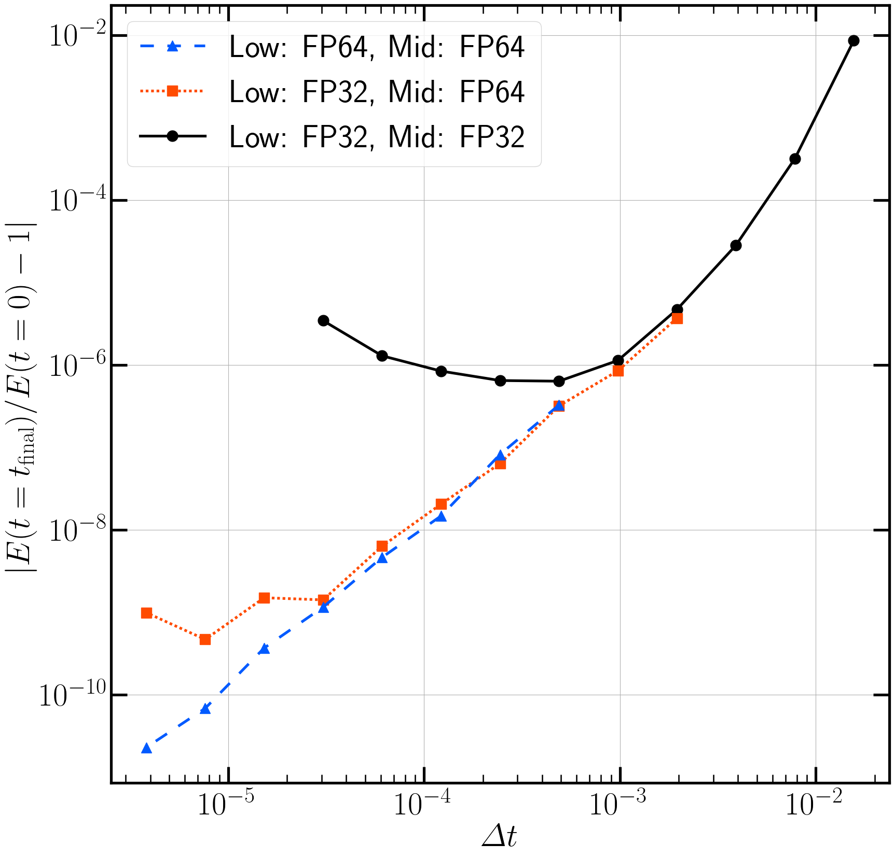
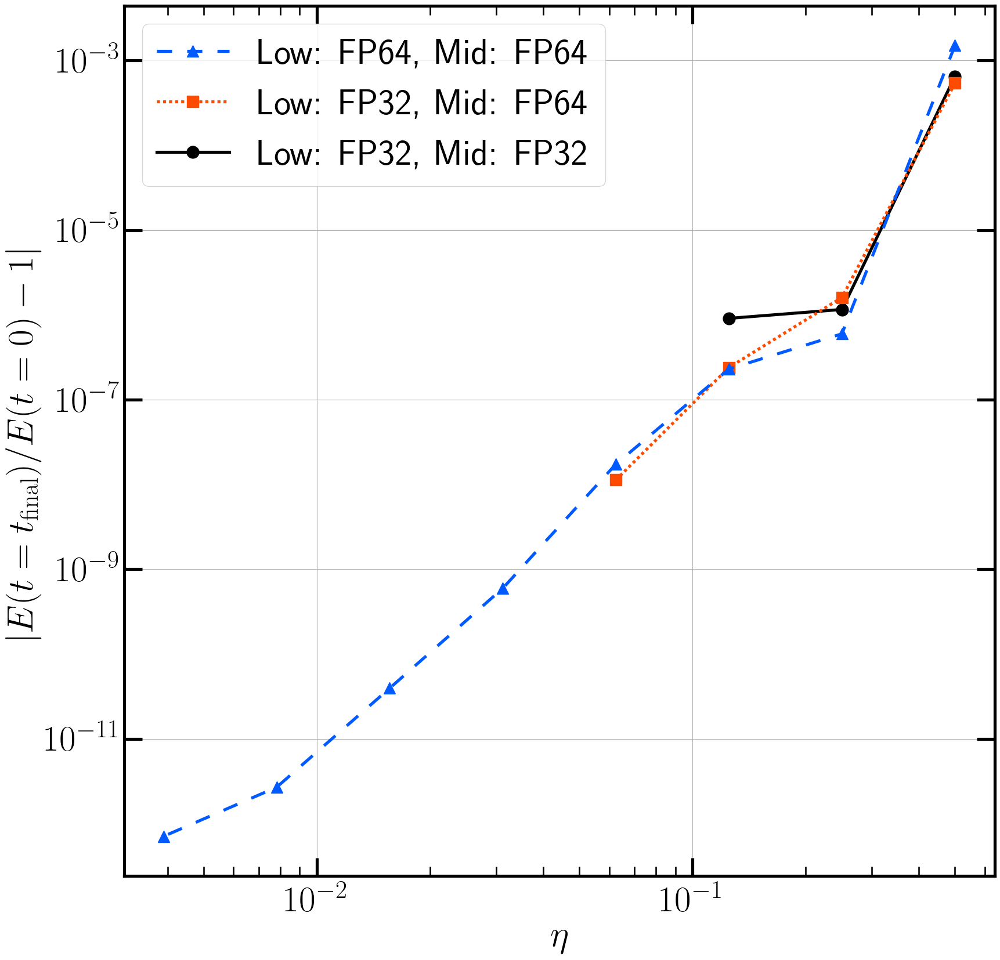

# $N$体計算コード実装の概要

$N$体計算コード（直接法）の実装概要の紹介

* GitHub 上では数式表示が乱れることを確認しています
* 手元の VisualStudio Code で markdown をプレビューすれば正しく表示されます

## 基礎方程式

$$
\vec{a}_i = \sum_{j \neq i}^N \frac{G m_j \vec{r}_{ji}}{\left({r_{ji}^2 + \epsilon^2}\right)^{3 / 2}}
,\quad\mathrm{where}\,\,
\vec{r}_{ji} \equiv \vec{r}_j - \vec{r}_i
.
$$

* $m_i$, $\vec{r}_i$, $\vec{a}_i$はそれぞれ$i$番目の粒子の質量，位置および加速度であり，全粒子数を$N$とする
  * 力を受ける粒子を$i$粒子，力を及ぼす粒子を$j$粒子と呼ぶ
* $G$は重力定数であり，本サンプルコードの単位系では$G = 1$として取り扱っている
* $\epsilon$は重力ソフトニングであり，ここではPlummerソフトニングを採用している
  * $N$体計算を実行する上で重力ソフトニングに対する理解は必須であるが，ここでは詳細には触れない
* 直接法においては，重力計算の演算量は$\mathcal{O}\left(N^2\right)$である

## 実装

### Leapfrog法（時間2次精度）

* 無衝突系$N$体計算においてよく採用される
* 固定・共有時間刻みの下ではSymplectic性が保証されるため，エネルギー保存も良好である

$$
\vec{v}_i^{n + 1 / 2} = \vec{v}_i^{n - 1 / 2} + \varDelta t \vec{a}_i^{n}
,\\
\vec{r}_i^{n + 1} = \vec{r}_i^{n} + \varDelta t \vec{v}_i^{n + 1/2}
.
$$

* 下付き添字は粒子IDを，上付き添字は時刻のインデックス（$n$ステップ目など）を表している
* 速度を定義している時刻が$1/2$ステップ分だけずれているため，計算開始時およびスナップショット出力時にはそれぞれ開始公式および終了公式が必要となる

$$
\vec{v}_i^{1 / 2} = \vec{v}_i^{0} + \frac{\varDelta t}{2} \vec{a}_i^{0}
,\\
\vec{v}_i^{n} = \vec{v}_i^{n + 1 / 2} - \frac{\varDelta t}{2} \vec{a}_i^{n}
.
$$

* エネルギー保存の$\varDelta t$依存性
  * 
  * 時間2次精度となっていることが確認できる
    * 全て単精度（Low: FP32, Mid: FP32）で実行した際には，$10^{-6}$程度が誤差の下限値となる
      * $\varDelta t$をさらに小さくすると，局所誤差（ステップごとの誤差）が小さくならないにも関わらずステップ数だけが増大するため大域誤差が増加していく
    * 混合精度（Low: FP32, Mid: FP64）で実行した際には，$10^{-9}$程度が誤差の下限値となる

### Hermite法（時間4次精度）

* 衝突系$N$体計算においてよく採用される
* 独立時間刻みの採用も可能だが，SIMD演算器やマルチコアを有効に使用するために階層化時間刻みが用いられることが多い
* 時間積分には予測子・修正子法を用い，加速度だけではなく加速度の時間1階微分（jerk）も計算し，3次のHermite補間多項式を用いて時間4次精度を実現している

  $$
  \frac{\mathrm{d}\vec{a}_i}{\mathrm{d}t} = \sum_{j \neq i}^N G m_j \left[\frac{\vec{v}_{ji}}{\left({r_{ji}^2 + \epsilon^2}\right)^{3 / 2}} - \frac{3 \left(\vec{r}_{ji} \cdot \vec{v}_{ji}\right) \vec{r}_{ji}}{\left({r_{ji}^2 + \epsilon^2}\right)^{5 / 2}}\right]
  .
  $$
  * ステップ毎に$i$粒子の数は桁で変化する
  * $j$粒子の数は全ステップにおいて$N$である
  * 時間刻みについては，[Nitadori & Makino (2008)](https://doi.org/10.1016/j.newast.2008.01.010) によって一般化された式を用いて設定している
    * 時間刻みがパラメータ$\eta$に比例する形で設定される
* エネルギー保存の$\eta$依存性
  * 
  * 時間4次精度となっていることが確認できる
    * 全て単精度（Low: FP32, Mid: FP32）で実行した際には，$10^{-6}$程度が誤差の下限値となる

## テスト問題（cold collapse）

### 概要

* 半径$R = 1$の球内に一様密度で粒子を分布させ，自己重力だけを考えて時間発展させる
* 全質量$M = 1$とし，粒子質量は全て等質量とする

### 結果を解釈するために必要な前提知識

* 自由落下時間$t_\mathrm{ff}$
  $$
  t_\mathrm{ff} = \sqrt{\frac{3 \pi}{32 G \rho}}
  =\sqrt{\frac{\pi^2 R^3}{8 G M}}
  .
  $$

  * $G=1$の単位系を採用しているので，標準設定である$R = 1$, $M = 1$の下では$t_\mathrm{ff} \simeq 1.11$となる
* ビリアル定理
  * 系の全運動エネルギーを$K$，全ポテンシャルエネルギーを$W$とした際に，定常状態では$2K + W = 0$が成り立つ（スカラービリアル定理）
    * 系の形状には依らない
  * このとき，ビリアル比$-K / W$の値は$1/2$となる
